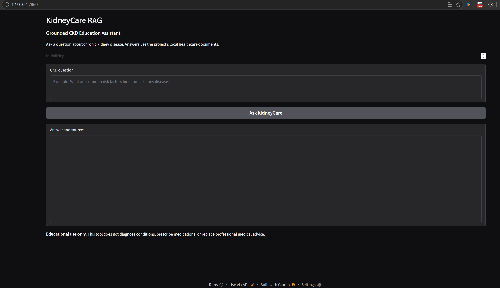

# KidneyCare RAG

## Grounded CKD Education Assistant

KidneyCare RAG is a retrieval-augmented generation (RAG) application designed to provide **grounded educational information about chronic kidney disease (CKD)** using a fixed collection of local healthcare documents.

The application retrieves relevant passages from local CKD documents, provides those passages as context to a language model, and presents the generated answer together with the retrieved sources.

> **Educational use only.** KidneyCare RAG does not diagnose conditions, prescribe medications, provide individualized treatment plans, or replace professional medical advice.

## Project Objective

The project demonstrates how a healthcare-focused RAG system can combine:

- Local healthcare documents
- Text extraction and preprocessing
- Semantic embeddings
- FAISS vector search
- Retrieval-grounded generation
- A Gradio user interface
- Source and similarity-score reporting
- Evaluation of supported and unsupported questions

The project intentionally uses a **static local document collection** rather than live web search or runtime website access.

---

## How It Works

The application follows this workflow:

```text
Local CKD PDF documents
        ↓
PDF text extraction
        ↓
Text cleaning and chunking
        ↓
Sentence Transformer embeddings
        ↓
FAISS vector index
        ↓
Relevant document retrieval
        ↓
Hugging Face language model
        ↓
Grounded answer
        ↓
Answer + retrieved sources
        ↓
Gradio interface
```

### RAG Components

1. **Document loading** — extracts text from local PDF documents.
2. **Chunking** — divides document text into smaller overlapping sections.
3. **Embedding generation** — converts chunks into semantic vectors using Sentence Transformers.
4. **Vector retrieval** — FAISS retrieves the most relevant chunks for a user's question.
5. **Answer generation** — the retrieved context is supplied to the language model.
6. **Grounding check** — questions with insufficient retrieval relevance are rejected.
7. **User interface** — Gradio displays the answer and retrieved source information.

---

## Technology Stack

| Component | Technology |
|---|---|
| Language | Python |
| User Interface | Gradio |
| PDF Processing | pypdf |
| Embeddings | Sentence Transformers |
| Embedding Model | `sentence-transformers/all-MiniLM-L6-v2` |
| Vector Database | FAISS |
| Generation Model | `google/flan-t5-base` |
| Deep Learning | PyTorch |
| Testing | pytest |
| Evaluation | Custom Python evaluation script |

---

## Project Structure

```text
KidneyCare-RAG/
│
├── data/
│   ├── CDC_CKD_2026.pdf
│   ├── CDC_CKD_Factsheet.pdf
│   ├── CDC_CKD_2023.pdf
│   ├── NIDDK_CKD_Guide.pdf
│   ├── README.md
│   └── SOURCES.md
│
├── docs/
│   └── kidneycare-ui.png
│
├── evaluation/
│   ├── questions.json
│   └── evaluate.py
│
├── src/
│   ├── __init__.py
│   ├── app.py
│   ├── chunker.py
│   ├── document_loader.py
│   ├── rag_pipeline.py
│   └── vector_store.py
│
├── tests/
│   └── test_basic.py
│
├── .github/
│   └── workflows/
│       └── validate.yml
│
├── .gitignore
├── README.md
├── EVALUATION.md
└── requirements.txt
```

---

## Healthcare Source Documents

The current local knowledge base contains CKD documents from authoritative healthcare sources, including CDC and NIDDK materials.

The source list and source information are documented in:

```text
data/SOURCES.md
```

The application does not perform live web searches during question answering.

---

## Installation

### 1. Clone the repository

```powershell
git clone https://github.com/sudheera96/KidneyCare-RAG.git
cd KidneyCare-RAG
```

### 2. Create a virtual environment

Windows PowerShell:

```powershell
python -m venv .venv
```

Activate it:

```powershell
.\.venv\Scripts\Activate.ps1
```

### 3. Install dependencies

```powershell
python -m pip install --upgrade pip
pip install -r requirements.txt
```

---

## Run the Application

From the repository root:

```powershell
python -m src.app
```

The Gradio application will start locally.

Open the local URL shown in the terminal, typically similar to:

```text
http://127.0.0.1:7860
```

### Example Questions

Supported CKD questions include:

```text
What is chronic kidney disease?
```

```text
What are common risk factors for chronic kidney disease?
```

```text
How is chronic kidney disease tested or detected?
```

```text
What does CKD management generally involve?
```

Questions unrelated to the local CKD knowledge base should be rejected rather than answered from outside information.

---

## Application Screenshot

The following screenshot shows the working KidneyCare RAG Gradio interface running locally.



The interface provides:

- A CKD question field
- An **Ask KidneyCare** button
- An answer and source area
- An educational-use disclaimer

---

## Evaluation

The project includes a separate evaluation report documenting the evaluation questions, generated answers, retrieved sources, similarity scores, observations, and limitations.

### Evaluation Report

**[View the complete Evaluation Report →](EVALUATION.md)**

The evaluation contains:

- **5 supported CKD questions**
- **3 unsupported/out-of-scope questions**
- Retrieved document sources
- Page numbers
- Similarity scores
- Generated answers
- Evaluation observations
- Retrieval score summary
- Limitations and future improvements

Run the evaluation with:

```powershell
python -m evaluation.evaluate
```

The evaluation questions are stored in:

```text
evaluation/questions.json
```

---

## Evaluation Summary

The current evaluation demonstrates that the retrieval layer generally distinguishes CKD-related questions from unrelated questions.

Observed retrieval similarity ranges:

| Question Category | Observed Similarity Range |
|---|---:|
| Supported CKD questions | Approximately 0.64–0.79 |
| Unsupported questions | Approximately 0.03–0.16 |

The unsupported questions were correctly rejected with the message:

> The available KidneyCare documents do not provide enough relevant information to answer this question.

The detailed results and individual question outputs are documented in **[EVALUATION.md](EVALUATION.md)**.

The evaluation is a functional and retrieval-grounding assessment. It should not be interpreted as clinical validation or a formal clinical accuracy study.

---

## Testing

Run the automated tests with:

```powershell
python -m pytest -q
```

The GitHub Actions workflow also performs basic source validation and testing.

---

## Safety and Scope

KidneyCare RAG is intentionally limited to educational CKD information.

The system does **not**:

- Diagnose conditions
- Prescribe medications
- Recommend individualized treatment plans
- Analyze personal medical records
- Provide live/current information outside the local document collection
- Replace professional medical advice

The application is designed to demonstrate grounded AI and human-computer interaction concepts in a healthcare education setting.

---

## Reproducibility

The project is structured so that another user can:

1. Clone the GitHub repository.
2. Create a Python virtual environment.
3. Install the requirements.
4. Use the included local CKD documents.
5. Run the Gradio application.
6. Run the evaluation script.
7. Run the automated tests.

The main components are separated into document loading, chunking, vector retrieval, RAG generation, application UI, evaluation, and tests.

---

## Repository

**GitHub:**  
https://github.com/sudheera96/KidneyCare-RAG

---

## Project Deliverables

This repository contains the primary implementation artifacts for the KidneyCare RAG group project:

- RAG source code
- Gradio application
- Local healthcare document collection
- Source documentation
- Evaluation questions
- Evaluation script
- Automated tests
- GitHub Actions validation workflow
- Application screenshot
- Project README
- Detailed evaluation report

---

## License / Academic Use

This repository was developed as an academic project for demonstrating retrieval-augmented generation, healthcare information grounding, and human-computer interaction concepts.
